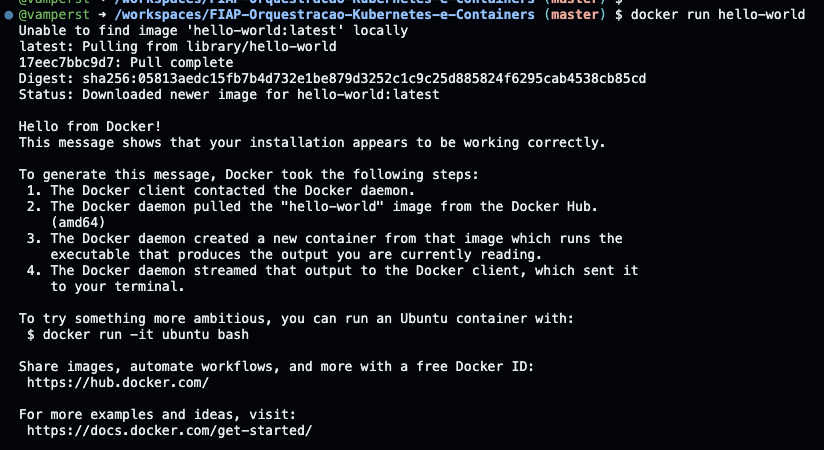
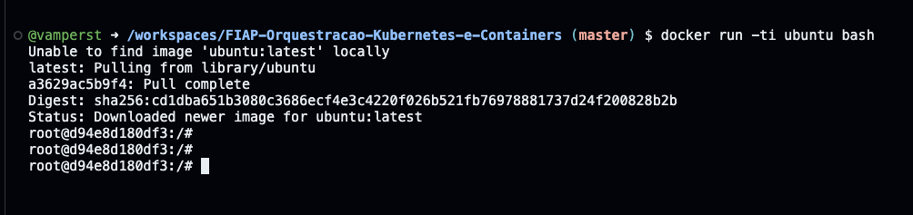
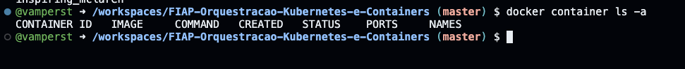
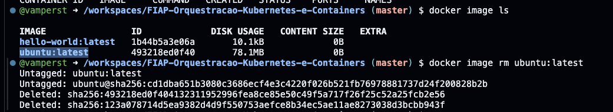
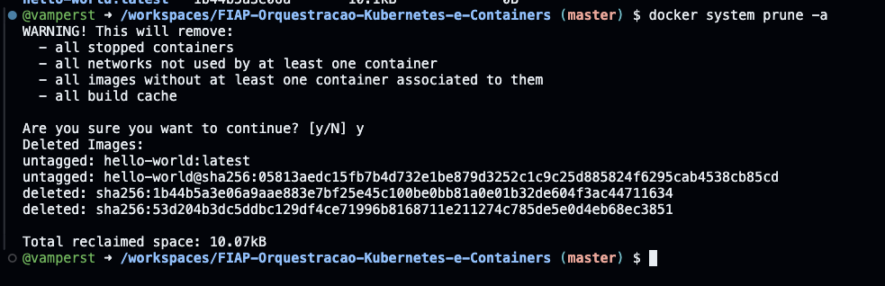

## Conteiners 1.1 - Helloworld

1. No terminal do codespaces récem criado digite `docker run hello-world`
   

 
<b>Explicação docker run hello-world </b>

<blockquote>
O comando `docker run hello-world` é normalmente o **primeiro comando executado por quem está começando com Docker**, pois ele serve para validar se o Docker está corretamente instalado e funcionando no sistema. Esse comando executa um container extremamente simples, criado exclusivamente para testar o funcionamento do Docker Engine.

### Sintaxe básica

    docker run IMAGE

No caso deste exemplo:

    docker run hello-world

- `docker run` cria e executa um container.
- `hello-world` é o nome da imagem Docker que será utilizada.

### O que o comando faz passo a passo

1. **Verifica se a imagem existe localmente**  
   O Docker procura a imagem `hello-world` no repositório local de imagens. Caso ela não exista, o Docker inicia automaticamente o processo de download.

2. **Faz o download da imagem no Docker Hub**  
   A imagem `hello-world` é baixada do Docker Hub, o repositório oficial de imagens Docker mantido pela própria equipe do Docker.  

   Documentação oficial do Docker Hub:  
   https://docs.docker.com/docker-hub/

3. **Cria um container a partir da imagem**  
   Após o download, o Docker cria um container temporário baseado na imagem `hello-world`.

4. **Executa o container**  
   O container executa um pequeno programa interno que imprime uma mensagem no terminal informando que o Docker está funcionando corretamente.

5. **Finaliza o container**  
   Assim que a mensagem é exibida, o processo termina e o container é encerrado automaticamente.

### Saída esperada

    Hello from Docker!
    This message shows that your installation appears to be working correctly.

Essa saída confirma que:
- O Docker Engine está rodando corretamente
- O Docker consegue baixar imagens
- O Docker consegue criar e executar containers

### Conceitos importantes envolvidos

- **Imagem Docker**: pacote imutável que contém a aplicação e todas as suas dependências.
- **Container**: instância em execução de uma imagem.
- **Docker Hub**: registro público onde imagens Docker são armazenadas e distribuídas.

### Documentação oficial

- Docker CLI – `docker run`:  
  https://docs.docker.com/engine/reference/commandline/run/

- Imagem `hello-world` no Docker Hub:  
  https://hub.docker.com/_/hello-world

- Visão geral sobre containers Docker:  
  https://docs.docker.com/get-started/overview/

### Conclusão

O comando `docker run hello-world` é essencial para validar se o Docker está corretamente instalado e operacional. Ele confirma todo o fluxo básico do Docker, desde o download de imagens até a criação e execução de containers, sendo um ponto de partida ideal para quem está aprendendo a tecnologia.
</blockquote>

2. Suba um container ubuntu em entre nele na maneira interativa com o comando `docker run -ti ubuntu bash`. A opções "-ti" são as responsáveis por após a criação do container fazer o acesso a ele através do terminal.

 
<b>Explicação docker run -ti ubuntu bash </b>

<blockquote>
O comando `docker run -ti ubuntu bash` é utilizado para iniciar um container de forma **interativa**, permitindo que o usuário acesse diretamente um terminal dentro do container. Neste caso, o foco está nas opções `-t` e `-i`, que são fundamentais quando queremos interagir manualmente com um container, como se estivéssemos acessando um sistema Linux via terminal.

### Sintaxe básica

    docker run [opções] IMAGEM COMANDO

No exemplo:

    docker run -ti ubuntu bash

- `ubuntu` é a imagem base do sistema operacional Ubuntu.
- `bash` é o comando que será executado dentro do container.
- `-ti` define como a interação com o container ocorrerá.

### Entendendo as opções -t e -i

As opções `-t` e `-i` são frequentemente usadas juntas e controlam como o Docker lida com entrada e saída de dados no terminal.

#### Opção `-i` (interactive)

- Mantém a **entrada padrão (STDIN)** aberta, mesmo que o container não esteja anexado a um terminal físico.
- Permite que você digite comandos dentro do container.
- Sem essa opção, o container pode encerrar imediatamente ao tentar interagir com ele.

#### Opção `-t` (tty)

- Aloca um **pseudo-terminal (TTY)** para o container.
- Faz com que o terminal dentro do container se comporte como um terminal Linux real.
- Melhora a formatação da saída de texto e o comportamento de comandos interativos, como `bash`, `top` e `apt`.

#### Por que usar `-ti` juntos?

- `-i` garante que você possa enviar comandos para o container.
- `-t` garante que o terminal responda corretamente a esses comandos.
- Juntas, essas opções permitem uma experiência interativa completa, semelhante a acessar uma máquina Linux via SSH.

### O que acontece ao executar o comando

1. O Docker verifica se a imagem `ubuntu` existe localmente.
2. Caso não exista, a imagem é baixada do Docker Hub oficial.
3. Um novo container é criado a partir da imagem Ubuntu.
4. O comando `bash` é iniciado como processo principal do container.
5. O terminal do usuário é conectado diretamente ao shell do container.

Após a execução, o prompt muda para algo semelhante a:

    root@<container_id>:/#

Isso indica que você está logado como usuário `root` dentro do container Ubuntu.

### Encerrando o container

Ao sair do shell com o comando:

    exit

ou pressionando `Ctrl + D`, o processo `bash` é finalizado e, como ele é o processo principal, o container também é encerrado automaticamente.

### Documentação oficial

- Docker CLI – opções `-i` e `-t`:  
  https://docs.docker.com/engine/reference/run/#foreground
- Docker CLI – `docker run`:  
  https://docs.docker.com/engine/reference/commandline/run/
- Imagem oficial Ubuntu no Docker Hub:  
  https://hub.docker.com/_/ubuntu

### Conclusão

O uso das opções `-ti` no comando `docker run` é essencial sempre que for necessário **interagir manualmente com um container**, especialmente para acessar shells como o `bash`. Elas garantem que o container aceite comandos do usuário e responda corretamente no terminal, tornando o Docker uma ferramenta prática para testes, aprendizado e depuração de ambientes Linux.
</blockquote>

1.  Saia do container digitando `exit`
2.  Outra maneira de ver os containers em execução é o comando  `docker container ls`

8. Utilize o comando `docker container ls -a` para ver todos os containers ativos e inativos do host

 
<b>Explicação docker container ls -a </b>

<blockquote>
O comando `docker container ls -a` é utilizado para **listar todos os containers existentes no Docker**, incluindo aqueles que **não estão em execução no momento**. Esse comando é fundamental para entender o ciclo de vida dos containers e para gerenciar containers que já foram criados anteriormente.

### Sintaxe básica

    docker container ls [opções]

No caso deste exemplo:

    docker container ls -a

- `docker container ls` lista containers.
- `-a` é a opção que altera o comportamento padrão do comando.

### Entendendo a opção `-a`

Por padrão, o Docker mostra **apenas os containers em execução**.  
A opção `-a` (abreviação de `--all`) instrui o Docker a exibir **todos os containers**, independentemente do estado.

Com `-a`, são listados containers nos seguintes estados:
- `running` (em execução)
- `exited` (finalizados)
- `created` (criados, mas nunca iniciados)
- `paused` (pausados)
- `dead` (estado de erro)

### O que o comando faz na prática

Ao executar `docker container ls -a`, o Docker:

1. Consulta o banco de dados interno do Docker Engine.
2. Recupera informações sobre todos os containers existentes no host.
3. Exibe uma tabela contendo detalhes importantes de cada container.

### Informações exibidas na saída

A saída do comando inclui colunas como:

- **CONTAINER ID**: identificador único do container.
- **IMAGE**: imagem usada para criar o container.
- **COMMAND**: comando principal executado no container.
- **CREATED**: quando o container foi criado.
- **STATUS**: estado atual do container.
- **PORTS**: portas expostas (se houver).
- **NAMES**: nome do container.

Exemplo de saída simplificada:

    CONTAINER ID   IMAGE     COMMAND   STATUS                     NAMES
    a1b2c3d4e5f6   ubuntu    bash      Exited (0) 2 minutes ago   nostalgic_babbage

### Por que esse comando é importante

- Permite identificar containers que já foram executados e estão parados.
- Ajuda a limpar containers antigos que não são mais necessários.
- É essencial para depuração, pois containers que falharam geralmente aparecem como `exited`.
- Facilita a reutilização de containers existentes.

### Diferença entre `docker ps` e `docker container ls -a`

- `docker ps` → mostra apenas containers em execução.
- `docker container ls -a` → mostra **todos** os containers, ativos ou não.

Ambos os comandos são equivalentes em funcionalidade quando as mesmas opções são usadas, pois `docker ps` é um alias histórico.

### Documentação oficial

- Docker CLI – `docker container ls`:  
  https://docs.docker.com/engine/reference/commandline/container_ls/
- Docker CLI – listando containers:  
  https://docs.docker.com/engine/reference/commandline/ps/

### Conclusão

O comando `docker container ls -a` é essencial para a administração de containers Docker, pois fornece uma visão completa de todos os containers existentes no ambiente, permitindo controle, diagnóstico e limpeza adequada do ambiente de containers.
</blockquote>

9. Utilize o comando `docker image ls` para ver todos as imagens do host

 
<b>Explicação docker image ls </b>

<blockquote>
O comando `docker image ls` é utilizado para **listar todas as imagens Docker disponíveis localmente** no sistema. Ele permite visualizar quais imagens já foram baixadas ou criadas, sendo um comando essencial para o gerenciamento de imagens no ambiente Docker.

### Sintaxe básica

    docker image ls [opções]

No caso deste exemplo:

    docker image ls

### O que o comando faz na prática

Ao executar `docker image ls`, o Docker:

1. Consulta o repositório local de imagens do Docker Engine.
2. Recupera todas as imagens armazenadas localmente.
3. Exibe uma lista organizada com informações relevantes sobre cada imagem.

Por padrão, **somente imagens locais são exibidas**. O comando não consulta repositórios remotos como o Docker Hub.

### Informações exibidas na saída

A saída do comando apresenta uma tabela com colunas importantes:

- **REPOSITORY**: nome da imagem (repositório).
- **TAG**: versão da imagem.
- **IMAGE ID**: identificador único da imagem.
- **CREATED**: data de criação da imagem.
- **SIZE**: espaço ocupado pela imagem em disco.

Exemplo de saída simplificada:

    REPOSITORY     TAG       IMAGE ID       CREATED        SIZE
    ubuntu         latest    1d622ef86b13   2 weeks ago    77MB
    hello-world    latest    d1165f221234   3 weeks ago    13kB

### Por que esse comando é importante

- Permite verificar quais imagens já estão disponíveis antes de executar um container.
- Ajuda a identificar imagens antigas ou não utilizadas.
- Facilita a limpeza de imagens desnecessárias para liberar espaço em disco.
- É útil para validar se o download de uma imagem ocorreu com sucesso.

### Relação entre imagens e containers

- **Imagens** são modelos imutáveis usados para criar containers.
- **Containers** são instâncias em execução (ou finalizadas) dessas imagens.
- Uma mesma imagem pode ser utilizada por vários containers diferentes.

### Comandos relacionados

- Remover uma imagem:
  
        docker image rm IMAGEM

- Listar apenas imagens não utilizadas (dangling):

        docker image ls -f dangling=true

### Documentação oficial

- Docker CLI – `docker image ls`:  
  https://docs.docker.com/engine/reference/commandline/image_ls/
- Conceitos de imagens Docker:  
  https://docs.docker.com/get-started/overview/

### Conclusão

O comando `docker image ls` é fundamental para entender quais imagens estão disponíveis localmente no Docker. Ele oferece visibilidade sobre versões, tamanhos e uso de imagens, sendo uma ferramenta indispensável para organização e manutenção do ambiente Docker.
</blockquote>

10. Agora que temos 2 containers iguais rodando, vamos parar e eliminar um deles com os seguintes comandos `docker container stop ubuntu-teste` e `docker container rm ubuntu-teste`

 
<b>Explicação docker container stop e rm </b>

<blockquote>
Os comandos `docker container stop ubuntu-teste` e `docker container rm ubuntu-teste` são utilizados em conjunto para **encerrar a execução de um container** e, em seguida, **removê-lo do ambiente Docker**. Esse fluxo é muito comum no gerenciamento de containers, especialmente em ambientes de estudo, testes e desenvolvimento.

### Sintaxe básica

    docker container stop NOME_DO_CONTAINER
    docker container rm NOME_DO_CONTAINER

No exemplo:

    docker container stop ubuntu-teste
    docker container rm ubuntu-teste

- `ubuntu-teste` é o nome atribuído ao container no momento da sua criação.

### Por que são dois comandos separados?

No Docker, **parar um container** e **remover um container** são ações distintas:

- Um container **precisa estar parado** para poder ser removido.
- O Docker não permite remover containers que estão em execução.

Por isso, o processo correto é:
1. Parar o container
2. Remover o container

### Entendendo o comando `docker container stop`

O comando `docker container stop` solicita que o Docker **encerre o container de forma graciosa**.

O que acontece internamente:
1. O Docker envia um sinal `SIGTERM` para o processo principal do container.
2. O processo tem um tempo padrão (10 segundos) para finalizar corretamente.
3. Se o processo não encerrar nesse período, o Docker envia um sinal `SIGKILL`, forçando a parada.

Após esse comando, o container passa do estado `running` para `exited`.

Documentação oficial:  
https://docs.docker.com/engine/reference/commandline/container_stop/

### Entendendo o comando `docker container rm`

O comando `docker container rm` remove **definitivamente o container** do Docker Engine.

O que é removido:
- Metadados do container
- Sistema de arquivos gravável do container
- Histórico de execução

O que **não** é removido:
- A imagem usada pelo container
- Volumes externos (a menos que explicitamente indicado)

Após a remoção, o container deixa de aparecer na listagem do comando `docker container ls -a`.

Documentação oficial:  
https://docs.docker.com/engine/reference/commandline/container_rm/

### Fluxo completo do que acontece

1. O container `ubuntu-teste` estava em execução.
2. `docker container stop ubuntu-teste` encerra o container com segurança.
3. `docker container rm ubuntu-teste` remove o container do ambiente.
4. O nome `ubuntu-teste` fica livre para ser reutilizado em um novo container.

### Comando alternativo (atalho)

É possível executar as duas ações em um único comando usando a opção `-f` (force):

    docker container rm -f ubuntu-teste

Esse comando força a parada e a remoção imediata do container, mas **não é recomendado para iniciantes**, pois não permite o encerramento gracioso do processo.

Documentação oficial:  
https://docs.docker.com/engine/reference/commandline/container_rm/#force-remove-a-running-container

### Conclusão

O uso combinado de `docker container stop` e `docker container rm` representa o fluxo correto e seguro para encerrar e remover containers Docker. Esse padrão ajuda a manter o ambiente organizado, evita conflitos de nomes e garante que recursos não utilizados sejam corretamente liberados.
</blockquote>

11. Agora com o comando `docker container ls -a` podemos ver que temos apenas 2 containers na maquina. Um ativo e um inativo.

12. Agora você vai forçar a remoção de um container em uso, para isso utilize o comando `docker container rm -f {nome do container ubuntu rodando}`. Para pegar o nome do container utilize o comando `docker container ls` e copie o nome do container que tem imagem ubuntu.

13. Agora temos apenas um container no host `docker container ls -a`

14.  Delete o container que sobrou com o comando `docker container rm -f {nome do container restante}`.
15.  Delete a imagem do ubuntu do seu host com o comando `docker image rm {image_id}`, para conseguir o image_id rode o comando `docker image ls`

16. Execute o mesmo procedimendo para a imagem do hello-world

17.  Para limpar o restante do host execute o comando `docker system prune -a`

 
<b>Explicação docker container stop e rm </b>

<blockquote>
O comando `docker system prune -a` é utilizado para **limpar recursos Docker que não estão mais sendo utilizados**, ajudando a liberar espaço em disco e manter o ambiente organizado. Esse comando é especialmente importante em ambientes de estudo, testes e desenvolvimento, onde containers e imagens são criados e removidos com frequência.

### Sintaxe básica

    docker system prune [opções]

No caso deste exemplo:

    docker system prune -a

### Entendendo o comando `docker system prune`

O comando `docker system prune` remove recursos Docker que **não estão em uso por containers ativos**. Ele atua de forma abrangente sobre vários tipos de recursos do Docker Engine.

Por padrão, sem opções adicionais, ele remove:
- Containers parados
- Redes não utilizadas
- Imagens sem referência (dangling images)
- Cache de build

### O papel da opção `-a`

A opção `-a` (abreviação de `--all`) torna a limpeza **mais agressiva**.

Com `-a`, o Docker também remove:
- **Todas as imagens que não estão sendo usadas por nenhum container**, mesmo que não sejam imagens dangling
- Imagens que podem ter sido baixadas, mas nunca utilizadas

Isso significa que, após a execução, **somente imagens usadas por containers em execução permanecerão no sistema**.

### O que acontece ao executar o comando

1. O Docker analisa todos os recursos existentes no ambiente.
2. Identifica quais containers estão parados.
3. Identifica imagens que não estão associadas a containers ativos.
4. Exibe uma mensagem solicitando confirmação do usuário.
5. Após a confirmação, remove os recursos identificados.

Exemplo de confirmação exibida:

    WARNING! This will remove:
      - all stopped containers
      - all networks not used by at least one container
      - all images without at least one container associated to them
      - all build cache

### Impactos e cuidados importantes

- Esse comando **não remove containers em execução**.
- Volumes **não são removidos por padrão**.
- Imagens removidas precisarão ser baixadas novamente caso sejam necessárias no futuro.
- É um comando **potencialmente destrutivo**, especialmente com a opção `-a`.

Por esse motivo, ele deve ser usado com atenção, principalmente em ambientes produtivos.

### Comandos relacionados

- Incluir volumes na limpeza:

        docker system prune -a --volumes

- Apenas visualizar o que pode ser removido (modo interativo padrão já ajuda a validar):

        docker system prune

### Documentação oficial

- Docker CLI – `docker system prune`:  
  https://docs.docker.com/engine/reference/commandline/system_prune/
- Gerenciamento de recursos Docker:  
  https://docs.docker.com/config/pruning/

### Conclusão

O comando `docker system prune -a` é uma ferramenta poderosa para limpeza completa do ambiente Docker. Ele ajuda a recuperar espaço em disco e manter o sistema organizado, mas deve ser usado com cuidado, pois remove imagens e recursos que podem precisar ser recriados posteriormente.
</blockquote>

