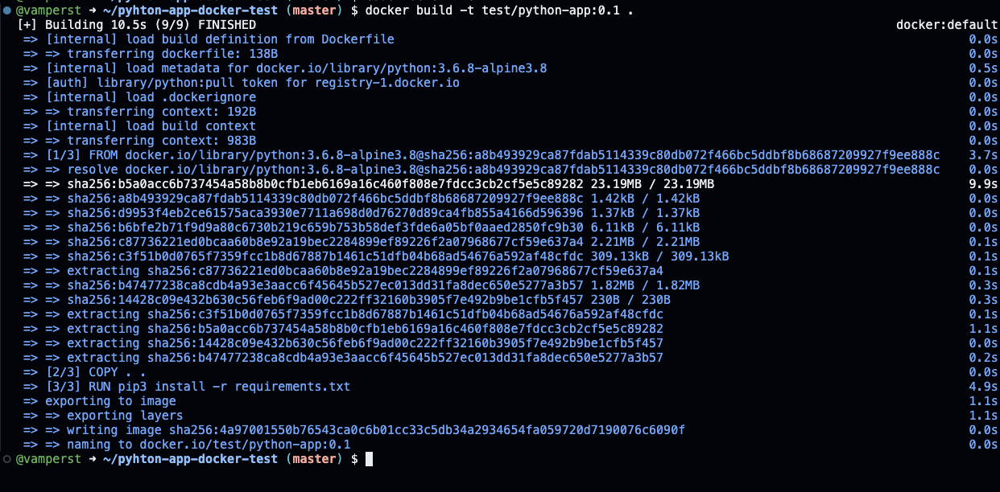
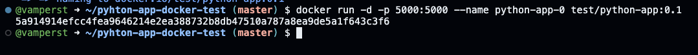
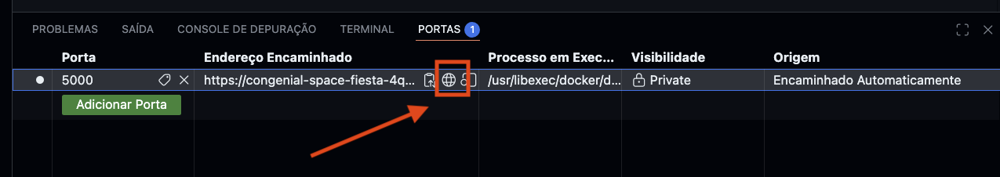
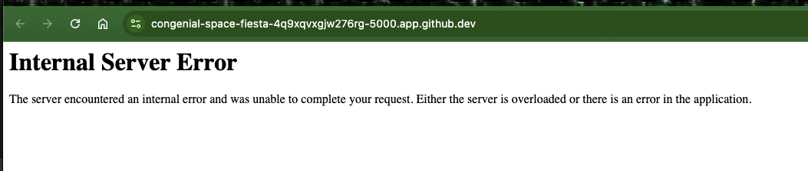
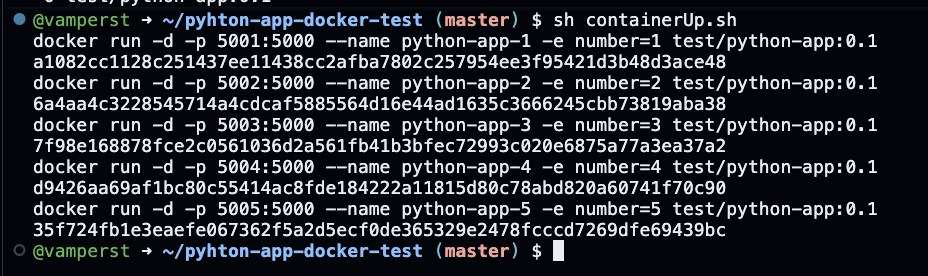
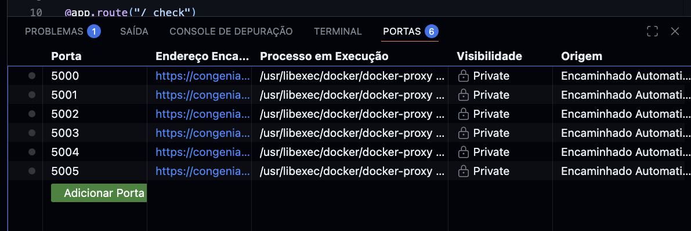
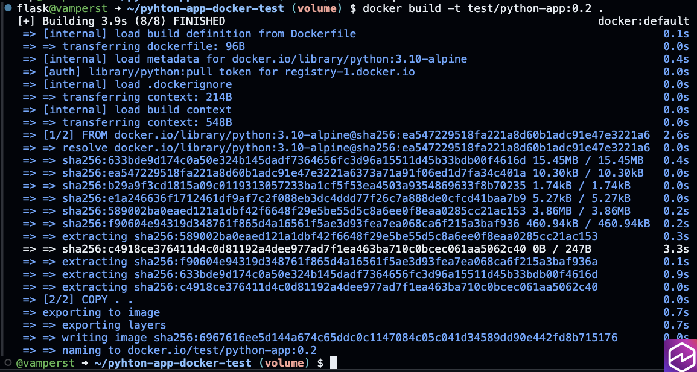
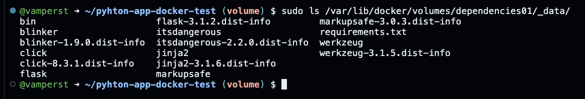

## Conteiners 1.2 - Dockerfile

1. Dentro do Cloud 9 execute o comando `cd /home/vscode`
1. Para baixar o repositório da demo execute o comando `git clone https://github.com/vamperst/pyhton-app-docker-test.git`

3. Entre na pasta pyhton-app-docker-test com o comando `cd pyhton-app-docker-test`
4. Para visualizar o Dockerfile utilize o comando `code Dockerfile`
5. Faça o build da primeira imagem docker com o seguinte comando no terminal `docker build -t test/python-app:0.1 .`

 
<b>Explicação docker build -t test/python-app:0.1 . </b>

<blockquote>
O comando `docker build -t test/python-app:0.1 .` é utilizado para **criar uma imagem Docker personalizada** a partir de um `Dockerfile` presente no diretório atual. Esse comando é essencial no fluxo de empacotamento de aplicações, pois transforma o código da aplicação e suas dependências em uma imagem reutilizável.

### Sintaxe básica

    docker build [opções] CAMINHO

No exemplo:

    docker build -t test/python-app:0.1 .

- `docker build` inicia o processo de build da imagem.
- `-t` define o nome e a tag da imagem.
- `test/python-app:0.1` é o nome completo da imagem.
- `.` indica o **contexto de build**, ou seja, o diretório atual.

### Entendendo a opção `-t`

A opção `-t` (abreviação de `--tag`) é usada para **identificar a imagem** criada pelo build.

Formato da tag:

    NOME[:TAG]

No exemplo:

- `test` → namespace ou organização (pode representar um usuário ou projeto).
- `python-app` → nome da imagem.
- `0.1` → versão da imagem.

Usar tags é uma boa prática, pois:
- Facilita o versionamento de imagens.
- Evita o uso excessivo da tag `latest`.
- Permite controle sobre qual versão da aplicação está sendo executada.

### O papel do ponto final (`.`)

O ponto (`.`) indica o **diretório atual** como contexto de build.

Isso significa que:
- O Docker envia os arquivos desse diretório para o Docker Engine.
- O `Dockerfile` deve estar nesse diretório (ou ser explicitamente informado).
- Arquivos referenciados no `Dockerfile` (como `COPY` e `ADD`) precisam estar dentro desse contexto.

### O que acontece durante o build

1. O Docker localiza o `Dockerfile` no diretório informado.
2. Cada instrução do `Dockerfile` é executada em ordem.
3. Para cada instrução, o Docker cria uma camada (layer) da imagem.
4. O cache é reutilizado sempre que possível para acelerar builds futuros.
5. Ao final do processo, a imagem é criada e armazenada localmente.

### Relação com o Dockerfile

O `Dockerfile` define:
- A imagem base (`FROM`)
- Dependências da aplicação
- Cópia de arquivos
- Comandos de inicialização

Sem um `Dockerfile`, o comando `docker build` não pode ser executado.

Documentação oficial do Dockerfile:  
https://docs.docker.com/engine/reference/builder/

### Verificando a imagem criada

Após o build, é possível confirmar a criação da imagem com:

    docker image ls

A imagem `test/python-app` com a tag `0.1` deve aparecer na listagem.

### Documentação oficial

- Docker CLI – `docker build`:  
  https://docs.docker.com/engine/reference/commandline/build/
- Conceitos de build de imagens:  
  https://docs.docker.com/get-started/docker-concepts/building-images/

### Conclusão

O comando `docker build -t test/python-app:0.1 .` permite transformar uma aplicação em uma imagem Docker versionada e reutilizável. O uso correto da opção `-t` e do contexto de build é fundamental para organização, versionamento e reprodutibilidade de aplicações containerizadas.
</blockquote>

6. Inicie um container com a imagem que acabou de criar: `docker run -d -p 5000:5000 --name python-app-0 test/python-app:0.1` 

 
<b>Explicação docker run -d -p 5000:5000 --name python-app-0 test/python-app:0.1 </b>

<blockquote>
O comando `docker run -d -p 5000:5000 --name python-app-0 test/python-app:0.1` é utilizado para **executar um container em segundo plano (modo desacoplado)**, expor uma aplicação para acesso externo e atribuir um nome explícito ao container. Esse padrão é muito comum para rodar aplicações web containerizadas.

### Sintaxe básica

    docker run [opções] IMAGEM

No exemplo:

    docker run -d -p 5000:5000 --name python-app-0 test/python-app:0.1

- `test/python-app:0.1` é a imagem que será utilizada para criar o container.
- `python-app-0` é o nome atribuído ao container.

### Entendendo a opção `-d` (detached)

A opção `-d` executa o container em **modo desacoplado**, ou seja:
- O container roda em segundo plano.
- O terminal do usuário é liberado após a execução do comando.
- O container continua em execução mesmo após o comando terminar.

Esse modo é ideal para aplicações que devem ficar ativas continuamente, como APIs e serviços web.

### Entendendo a opção `-p` (publish)

A opção `-p` é usada para **mapear portas** entre o host e o container.

Formato:

    PORTA_HOST:PORTA_CONTAINER

No exemplo:

    -p 5000:5000

- A porta `5000` do host é redirecionada para a porta `5000` do container.
- Qualquer acesso à porta `5000` da máquina host será encaminhado para a aplicação dentro do container.

Esse mapeamento é essencial para tornar serviços internos do container acessíveis externamente.

### Entendendo a opção `--name`

A opção `--name` define um **nome fixo e legível** para o container.

Vantagens de nomear containers:
- Facilita comandos de gerenciamento (`stop`, `start`, `rm`).
- Evita o uso de nomes aleatórios gerados pelo Docker.
- Torna o ambiente mais organizado e previsível.

### O que acontece ao executar o comando

1. O Docker verifica se a imagem `test/python-app:0.1` existe localmente.
2. Um novo container é criado a partir dessa imagem.
3. O container é iniciado em modo desacoplado.
4. A porta `5000` é exposta para acesso externo.
5. O container passa a executar a aplicação definida na imagem.

Após a execução, o container pode ser acessado via navegador ou ferramenta de teste HTTP usando:

    http://localhost:5000

### Verificando o container em execução

Para confirmar que o container está rodando:

    docker container ls

Para visualizar logs da aplicação:

    docker container logs python-app-0

### Documentação oficial

- Docker CLI – `docker run`:  
  https://docs.docker.com/engine/reference/commandline/run/
- Docker CLI – publicação de portas:  
  https://docs.docker.com/network/#published-ports
- Conceitos de containers em segundo plano:  
  https://docs.docker.com/get-started/overview/

### Conclusão

O comando `docker run -d -p 5000:5000 --name python-app-0 test/python-app:0.1` é um exemplo clássico de execução de aplicações web com Docker. Ele combina execução em background, exposição de portas e nomeação explícita do container, permitindo que a aplicação seja acessada de forma simples e organizada.
</blockquote>

7. No codespaces, na parte de baixo clique em "Portas"

  

8. Clique no icone de glogo da porta 5000 para ter acesso externo a porta do container.

9. O 'Internal server error' já era esperado, se visualizar o arquivo app.py com o comando `code app.py` vai notar que para funcionar o script precisar uma uma variável de ambiente chamada "number" na linha 

14. Remova o container criado com os comandos `docker container stop python-app-0` seguido de `docker container rm python-app-0`
15. Vamos subir um container agora com a variavel necessária utilizando o comando `docker run -d -p 5000:5000 --name python-app-0 -e number=0 test/python-app:0.1`
16. Acesse no navegador o ip da maquina na porta 5000, e veja se o script funcionou.

17. Vamos subir vários containers cada um com sua variável de ambiente, porta, e nome especifico. Para tal utilize o script containerUp.sh com o comando `sh containerUp.sh`

18.  Clique novamente na aba "Portas" do codespaces para ver as portas que foram mapeadas. Clique em cada um dos links para testar os containers.

19. Desça todos os containers com o script containerDown.sh utilizando o comando `sh containerDown.sh`. Não se esqueça de eliminar o container 0 com o comando `docker container rm -f python-app-0`
20. Agora podemos ver o tamanho que as imagens ficaram com o comando `docker image ls`

21. Note que a test/python-app:0.1 tem apenas 86 Mb na sua ultima layer, já que a imagem base python tem 74.5 Mb. Vamos diminuir isso para que os containers fiquem mais faceis de escalar.
22. Mude a branch do projeto para volume com o seguinte comando `git fetch && git checkout volume`

23. Note que houveram alterações importantes nos arquivos "app.py", "Dockerfile", e ".dockerignore"
O arquivo "app.py" agora aponta para '/dependencies' para procurar as dependecias do projeto;

O Dockerfile não precisa mais fazer a instalação das dependencias;

E por fim, foi adicionado a linha de ignorar o requirements.txt ao fazer o build da imagem

24. Faça o build da nova imagem com a tag 0.2 utilizando o seguinte comando `docker build -t test/python-app:0.2 .`

25. Agora vamos criar o volume onde ficarão as dependencias, para isso utilize o comando `docker volume create --name=dependencies01`

 
<b>Explicação ddocker volume create --name=dependencies01 </b>

<blockquote>
O comando `docker volume create --name=dependencies01` é utilizado para **criar um volume Docker nomeado**, que serve para armazenar dados de forma persistente fora do ciclo de vida dos containers. Volumes são a forma recomendada pelo Docker para persistência de dados.

### Sintaxe básica

    docker volume create [opções]

No exemplo:

    docker volume create --name=dependencies01

- `docker volume create` cria um novo volume.
- `--name` define explicitamente o nome do volume.
- `dependencies01` é o identificador do volume.

### O que é um volume Docker

Um volume Docker é um **mecanismo de armazenamento gerenciado pelo Docker** que:
- Existe independentemente de containers.
- Não é removido automaticamente quando um container é apagado.
- Pode ser compartilhado entre múltiplos containers.
- É armazenado em um diretório controlado pelo Docker no host.

Volumes são preferíveis a bind mounts em muitos cenários, pois abstraem detalhes do sistema de arquivos do host.

### O que acontece ao executar o comando

1. O Docker cria um volume vazio chamado `dependencies01`.
2. O volume passa a existir no gerenciamento interno do Docker Engine.
3. Nenhum container é automaticamente associado a ele.
4. O volume pode ser montado em containers futuros.

Após a criação, o volume pode ser listado com:

    docker volume ls

### Por que nomear volumes é importante

Nomear volumes traz benefícios importantes:
- Facilita o gerenciamento e identificação.
- Evita o uso de nomes aleatórios.
- Permite reutilização consistente do mesmo volume em diferentes containers.
- Ajuda na organização de ambientes de estudo e desenvolvimento.

### Como volumes são usados por containers

Um volume criado pode ser montado em um container usando a opção `-v` ou `--mount`, por exemplo:

    docker run -v dependencies01:/caminho/no/container IMAGEM

Nesse caso, qualquer dado gravado em `/caminho/no/container` será persistido no volume `dependencies01`.

### Diferença entre volumes e containers

- **Volumes** armazenam dados persistentes.
- **Containers** são efêmeros e podem ser criados e removidos a qualquer momento.
- Remover um container **não remove** o volume associado a ele.

### Documentação oficial

- Docker CLI – `docker volume create`:  
  https://docs.docker.com/engine/reference/commandline/volume_create/
- Gerenciamento de volumes Docker:  
  https://docs.docker.com/storage/volumes/

### Conclusão

O comando `docker volume create --name=dependencies01` cria um volume persistente que pode ser reutilizado por múltiplos containers. O uso de volumes é uma prática fundamental para garantir persistência de dados e organização adequada em ambientes Docker.
</blockquote>

26. Copie o arquivo de dependencias do projeto para dentro do volume com o comando `sudo cp requirements.txt /var/lib/docker/volumes/dependencies01/_data/`
27. Para carregar as dependencias necessárias para o volume execute um container python passando o entrypoint no run `docker run -ti -v dependencies01:/dependencies python:3.10 /bin/bash -c "pip3 install -r /dependencies/requirements.txt -t /dependencies"`

 
<b>Explicação docker run </b>

<blockquote>
O comando `docker run -ti -v dependencies01:/dependencies python:3.10 /bin/bash -c "pip3 install -r /dependencies/requirements.txt -t /dependencies"` é utilizado para **instalar dependências Python dentro de um volume Docker**, sem acoplar essas dependências a um container específico. Esse padrão é muito comum para preparar dependências reutilizáveis, especialmente em cenários de laboratório, serverless e build de aplicações.

### Sintaxe básica

    docker run [opções] IMAGEM COMANDO

No exemplo:

    docker run -ti -v dependencies01:/dependencies python:3.10 /bin/bash -c "pip3 install -r /dependencies/requirements.txt -t /dependencies"

### Entendendo a opção `-v` (volume)

A opção `-v` é usada para **montar um volume Docker dentro do container**.

Formato:

    VOLUME_HOST:CAMINHO_NO_CONTAINER

No exemplo:

    -v dependencies01:/dependencies

- `dependencies01` é o volume Docker previamente criado.
- `/dependencies` é o diretório dentro do container onde o volume será montado.

Tudo o que for gravado em `/dependencies` dentro do container será persistido no volume `dependencies01`, mesmo após o container ser removido.

### Por que usar um volume nesse comando

- O container Python é **temporário**.
- As dependências instaladas precisam ser **persistidas**.
- O volume permite reutilizar essas dependências em outros containers ou etapas do processo.
- Evita reinstalar pacotes Python repetidamente.

### Entendendo a imagem `python:3.10`

- `python:3.10` é uma imagem oficial do Docker Hub.
- Contém o interpretador Python 3.10 e o gerenciador de pacotes `pip`.
- É ideal para executar comandos pontuais relacionados a Python.

Documentação oficial da imagem Python:  
https://hub.docker.com/_/python

### Entendendo o comando executado no container

O comando executado dentro do container é:

    /bin/bash -c "pip3 install -r /dependencies/requirements.txt -t /dependencies"

Esse comando faz o seguinte:

- `/bin/bash -c` permite executar um comando como string.
- `pip3 install` instala pacotes Python.
- `-r /dependencies/requirements.txt` indica o arquivo com a lista de dependências.
- `-t /dependencies` define o diretório de destino da instalação.

Com isso:
- As bibliotecas Python são instaladas diretamente dentro do volume.
- Nenhuma dependência fica presa ao container.
- O resultado é um diretório reutilizável com todas as dependências prontas.

### O que acontece ao executar o comando

1. O Docker cria um container temporário usando a imagem `python:3.10`.
2. O volume `dependencies01` é montado em `/dependencies`.
3. O comando `pip3 install` lê o arquivo `requirements.txt`.
4. As dependências são baixadas e instaladas no volume.
5. O comando termina.
6. O container é encerrado ao final da execução.

O volume permanece com todas as dependências instaladas.

### Casos de uso comuns

- Preparar dependências para aplicações serverless (AWS Lambda, por exemplo).
- Compartilhar dependências entre múltiplos containers.
- Separar código da aplicação e bibliotecas.
- Reduzir tempo de build em pipelines.

### Documentação oficial

- Docker CLI – volumes (`-v`):  
  https://docs.docker.com/storage/volumes/
- Docker CLI – `docker run`:  
  https://docs.docker.com/engine/reference/commandline/run/
- pip – instalação de pacotes:  
  https://pip.pypa.io/en/stable/cli/pip_install/

### Conclusão

Esse comando demonstra um padrão avançado e eficiente de uso do Docker: utilizar containers apenas como ambiente de execução temporário, enquanto os dados importantes — neste caso, dependências Python — são persistidos em volumes reutilizáveis. Isso torna o ambiente mais modular, previsível e fácil de manter.
</blockquote>

28. Confirme que todas as dependecias estão no volume conforme desejado com o comando `sudo ls /var/lib/docker/volumes/dependencies01/_data/`

29. Suba o primeiro container apontando para o volume de dependecias com o comando `docker run -d -p 5000:5000 -v dependencies01:/dependencies --name python-app-0 -e number=0 test/python-app:0.2`

 
<b>Explicação docker run </b>

<blockquote>
O comando `docker run -d -p 5000:5000 -v dependencies01:/dependencies --name python-app-0 -e number=0 test/python-app:0.2` utiliza um **volume Docker** para disponibilizar dependências persistentes dentro do container da aplicação. Neste contexto, o foco está no uso de volumes como mecanismo de compartilhamento e persistência de dados entre containers.

### Sintaxe relevante para volumes

    docker run -v VOLUME:CAMINHO_NO_CONTAINER IMAGEM

No exemplo:

    -v dependencies01:/dependencies

### Entendendo o uso do volume `dependencies01`

O volume `dependencies01` foi previamente criado e já contém dependências Python instaladas. Ao montá-lo no container:

- O diretório `/dependencies` dentro do container passa a apontar para o volume.
- Todo conteúdo presente no volume fica imediatamente disponível para a aplicação.
- A aplicação pode importar bibliotecas Python diretamente desse caminho.

Esse padrão permite separar claramente:
- **Código da aplicação** (presente na imagem `test/python-app:0.2`)
- **Dependências** (persistidas no volume `dependencies01`)

### Por que usar volumes nesse cenário

O uso de volumes traz vantagens importantes:

- **Persistência**: as dependências não são perdidas ao remover o container.
- **Reutilização**: o mesmo volume pode ser montado em múltiplos containers.
- **Velocidade**: evita reinstalar dependências a cada novo build ou execução.
- **Isolamento**: mantém a imagem mais simples e menor.

Esse modelo é especialmente comum em:
- Ambientes de laboratório
- Arquiteturas serverless
- Pipelines de build e testes
- Aplicações que compartilham bibliotecas comuns

### O que acontece ao executar o comando

1. O Docker cria um novo container a partir da imagem `test/python-app:0.2`.
2. O volume `dependencies01` é montado no caminho `/dependencies`.
3. A aplicação passa a acessar as dependências diretamente do volume.
4. O container é iniciado em segundo plano e permanece em execução.

Mesmo que o container seja removido, o volume `dependencies01` continuará existindo com todas as dependências intactas.

### Boas práticas ao usar volumes

- Criar volumes nomeados para dados importantes.
- Evitar instalar dependências diretamente no container em tempo de execução quando elas podem ser reaproveitadas.
- Manter volumes com responsabilidades claras (por exemplo, apenas dependências).

### Documentação oficial

- Docker – Volumes:  
  https://docs.docker.com/storage/volumes/
- Docker CLI – opção `-v`:  
  https://docs.docker.com/engine/reference/commandline/run/

### Conclusão

O uso do volume `dependencies01` neste comando demonstra uma prática eficiente de desacoplamento entre aplicação e dependências. Volumes permitem persistência, reutilização e organização do ambiente Docker, tornando o ciclo de desenvolvimento mais rápido e previsível.
</blockquote>

30. Novamente em portas do codespaces clique no link da porta 5000 para testar o container.
31. Agora que tudo esta certo, vamos subir 5 containers apontando para o volume com o comando `sh containerUp.sh`
32. Teste os containers criados clicando nos links das portas em "Portas" no codespaces.

33. Veja a diferença do tamanho do container que aponta para um volume e um com todas as dependecias dentro utilizando com o comando `docker image ls`

34. Outra maneira de testar os containers seria uma chamada local dos ips dos containers, para isso descubra o ip dos containers com o comando `docker inspect python-app-0 | jq`

 
<b>Explicação docker inspect python-app-0 | jq </b>

<blockquote>
O comando `docker inspect python-app-0 | jq` é utilizado para **inspecionar detalhadamente a configuração de um container Docker** e apresentar essas informações de forma **legível e organizada**. Esse comando é muito útil para entender como um container foi criado, quais volumes estão montados, variáveis de ambiente, portas, redes e outras configurações internas.

### Sintaxe básica

    docker inspect OBJETO | jq

No exemplo:

    docker inspect python-app-0 | jq

- `python-app-0` é o nome do container que será inspecionado.
- O operador `|` (pipe) envia a saída de um comando para outro.
- `jq` é uma ferramenta para formatar e consultar dados no formato JSON.

### Entendendo o comando `docker inspect`

O comando `docker inspect` retorna **todas as informações conhecidas pelo Docker Engine** sobre um objeto, como:
- Containers
- Imagens
- Volumes
- Redes

No caso de um container, ele retorna um grande objeto JSON contendo, entre outros:

- Configuração da imagem usada
- Variáveis de ambiente (`Env`)
- Volumes montados (`Mounts`)
- Portas expostas e mapeadas
- Comando de inicialização
- Estado atual do container
- Redes associadas

Sem tratamento, essa saída é extensa e difícil de ler.

Documentação oficial:  
https://docs.docker.com/engine/reference/commandline/inspect/

### Por que usar `jq` junto com `docker inspect`

`jq` é uma ferramenta de linha de comando usada para **formatar, filtrar e consultar JSON**.

Ao usar:

    docker inspect python-app-0 | jq

- O JSON é exibido com identação correta.
- A leitura das informações fica muito mais clara.
- Facilita localizar campos importantes manualmente.

Sem `jq`, a saída aparece em uma única linha extensa.

Documentação oficial do jq:  
https://jqlang.github.io/jq/manual/

### Exemplos de informações úteis que podem ser analisadas

Com esse comando, é possível verificar facilmente:

- Volumes montados no container:

    Mounts

- Variáveis de ambiente:

    Config.Env

- Portas publicadas:

    NetworkSettings.Ports

- Imagem utilizada:

    Config.Image

Essas informações são essenciais para:
- Debug de containers
- Verificação de volumes e dependências
- Auditoria de configuração
- Aprendizado sobre o funcionamento interno do Docker

### O que acontece ao executar o comando

1. O Docker coleta todas as informações do container `python-app-0`.
2. O Docker retorna os dados no formato JSON bruto.
3. O `jq` formata e apresenta esse JSON de forma estruturada.
4. O usuário pode navegar visualmente pelos dados no terminal.

### Documentação oficial

- Docker CLI – `docker inspect`:  
  https://docs.docker.com/engine/reference/commandline/inspect/
- jq – Manual oficial:  
  https://jqlang.github.io/jq/manual/

### Conclusão

O comando `docker inspect python-app-0 | jq` é uma ferramenta poderosa para entender em profundidade como um container Docker está configurado. Ele combina a inspeção detalhada fornecida pelo Docker com a clareza e organização do `jq`, sendo indispensável para depuração, aprendizado e validação de ambientes containerizados.
</blockquote>

35. Para fazer curl em todos os containers use o script curlbycontainer.sh que ira usar o path _check(Health check ). Para fitrar o json o scrit usa jq. Execute o comando `sh curlbycontainer.sh`

36.  Para deletar todos os containers utilize o script containerDown.sh com o comando `sh containerDown.sh`. Não se esqueça de eliminar o container 0 com o comando `docker container rm -f python-app-0`
