## Conteiners 1.3 - Registry

**Antes de começar, execute os passos abaixo para configurar o ambiente caso não tenha feito isso ainda na aula de HOJE: [Preparando Credenciais](../../01-create-codespaces/Inicio-de-aula.md)**


1. No codespaces execute o comando `cd /home/vscode && git clone https://github.com/vamperst/pyhton-app-docker-test.git`, e após entre na pasta criada com o comando `cd pyhton-app-docker-test/`

3. Mude de branch do repositório com o sequinte comando `git fetch && git checkout registry`
   
   

4. Nos próximos passos vamos criar um repositório no ECR para sua imagem. Para tal abra o [link](https://us-east-1.console.aws.amazon.com/ecr/get-started?region=us-east-1) no seu navegador.
5. Clique em `Criar` no canto direito superior da tela.

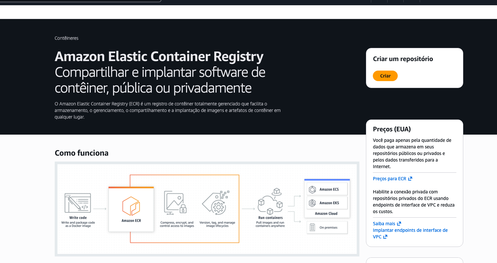

6. De o nome de `primeiraimagem` para o repositório e deixa as demais opções como estão. No final da página clique em `Criar`


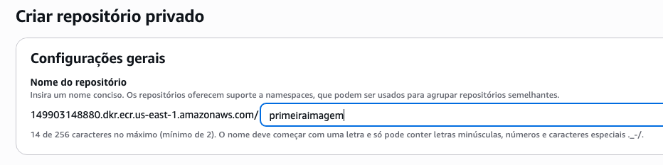

1. Quando o repositório é criado a tela fica como a imagem abaixo. Selecione o repositório. Clique em `Visualizar comando push` do canto superior direito.


9. Siga a sequancia de comandos apresentados na tela do ECR em seu codespaces para fazer o login no registry do ECR récem criado, fazer o build da imagem segundo o Dockerfile, colocar a devida tag e push para o registry.
    
    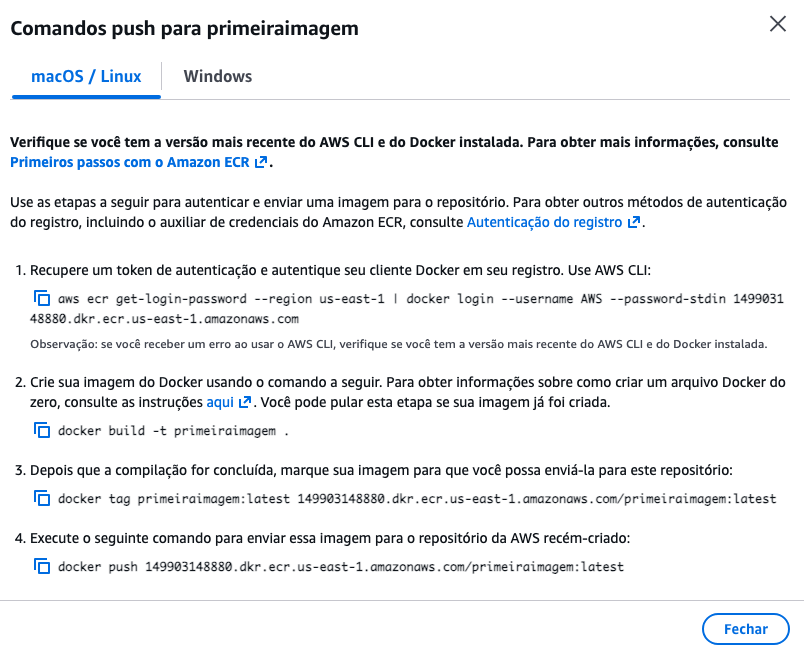

    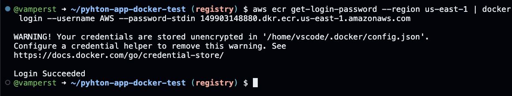

    

    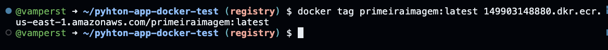

    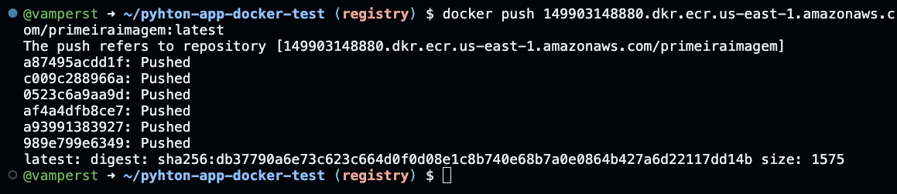

10. Apague todas as imagens com o comando `docker system prune -a` e confirme pressionando `y` quando pedido.
    
    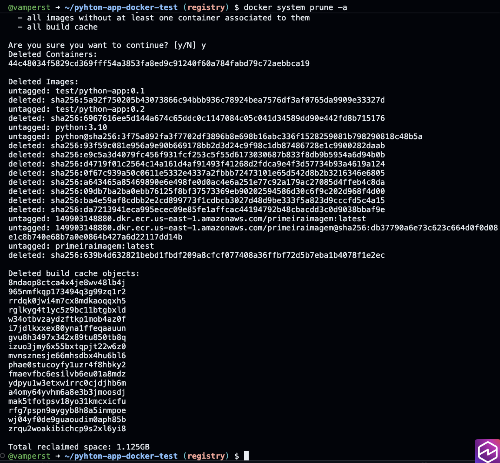

11. Se rodar o comando `docker image ls -a` verá que não tem nenhuma imagem guardada localmente.


12. Para baixar e executar a imagem novamente é necessário que pegue a URL do repositório no ECR. Para isso clique no [link](https://us-east-1.console.aws.amazon.com/ecr/private-registry/repositories?region=us-east-1) e copie o link conforme destacado na imagem abaixo.
    
    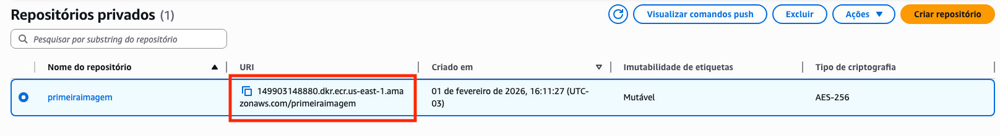

13. Baixe e execute a imagem que colocou no docker hub com o comando `docker run --name primeiro  -d -p 5000:5000 LINK COPIADO:latest`. Note que apenas a ultima layer foi baixada porque a imagem base necessària já esta no host usado. Isso diminui muito o quanto o docker tem que baixar a cada atualização.
   
    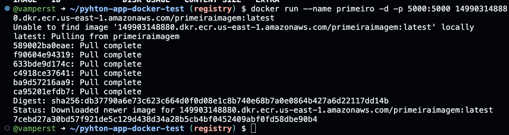

14. Para verificar que o container esta executando utilize o comando `docker container ls`
    
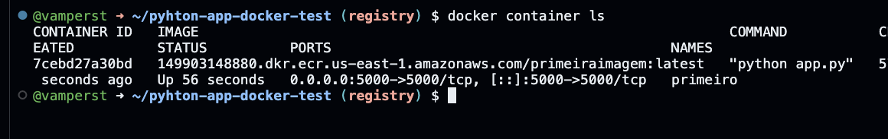

15. Clique em "Portas" para ver o link que deve acessar no navegador para testar a aplicação web que esta rodando dentro do container.
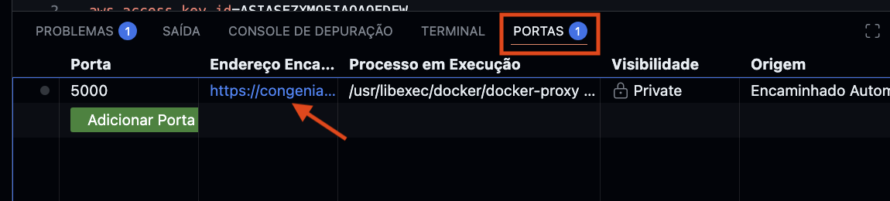

16. Acesse no navegador o link encontrado no passo anterior.
    


17. Pare e elimine o container que acabou de criar com os comandos abaixo.
``` shell
docker container stop primeiro
docker container rm primeiro
```
    
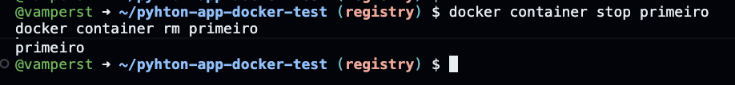

18.  Para alterar o conteudo do que é exibido no navegador quando executa um container da imagem criada utilize o comando `sed -i -e 's/!!!!/!1.1/g' app.py`

    
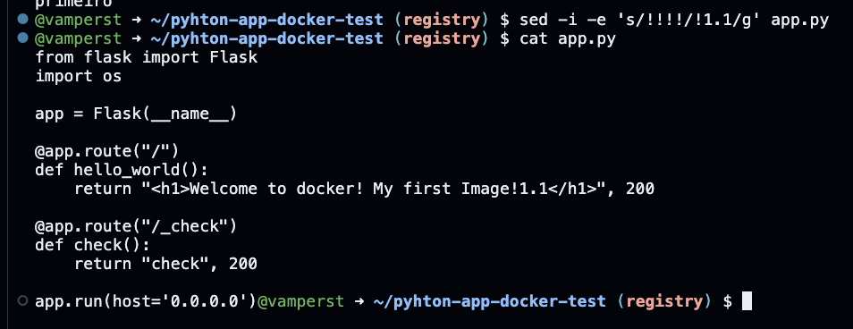

19. Execute os comando abaixo para criar uma nova imagem e fazer o push para o repositório no ECR. Copie e execute uma linha por vêz.

``` shell
accountID=`aws sts get-caller-identity | jq .Account -r`
aws ecr get-login-password --region us-east-1 | docker login --username AWS --password-stdin $accountID.dkr.ecr.us-east-1.amazonaws.com

docker build -t primeiraimagem:1.1 .

docker tag primeiraimagem:1.1 $accountID.dkr.ecr.us-east-1.amazonaws.com/primeiraimagem:1.1

docker push $accountID.dkr.ecr.us-east-1.amazonaws.com/primeiraimagem:1.1

```


<details>
<summary> 
<b>Explicação docker push </b>

</summary>

<blockquote>
O comando `docker push $accountID.dkr.ecr.us-east-1.amazonaws.com/primeiraimagem:1.1` é utilizado para **enviar (publicar) uma imagem Docker local para um repositório remoto no Amazon Elastic Container Registry (ECR)**. Esse passo é fundamental para disponibilizar a imagem para uso em serviços da AWS, como ECS, EKS ou outras execuções distribuídas.

### Sintaxe básica

    docker push REPOSITORY_URI:TAG

No exemplo:

    docker push $accountID.dkr.ecr.us-east-1.amazonaws.com/primeiraimagem:1.1

### Entendendo o endereço do repositório ECR

O endereço da imagem segue o padrão do Amazon ECR:

    <account_id>.dkr.ecr.<region>.amazonaws.com/<repository>:<tag>

No exemplo:

- `$accountID` → ID da conta AWS onde o ECR está criado.
- `us-east-1` → região AWS do repositório.
- `primeiraimagem` → nome do repositório no ECR.
- `1.1` → tag (versão) da imagem.

Esse endereço identifica de forma única onde a imagem será armazenada dentro da AWS.

### O que o comando `docker push` faz

Ao executar o comando, o Docker:

1. Verifica se a imagem existe localmente com esse nome e tag.
2. Valida a autenticação com o registro remoto (ECR).
3. Envia as camadas (layers) da imagem para o repositório.
4. Reutiliza camadas já existentes no ECR, se houver, para otimizar o envio.
5. Finaliza o push quando todas as camadas necessárias forem enviadas.

### Pré-requisitos importantes

Antes de executar `docker push` para o ECR, é necessário:

- Ter o repositório ECR previamente criado.
- Estar autenticado no ECR usando a AWS CLI.

Autenticação típica no ECR:

    aws ecr get-login-password --region us-east-1 | docker login --username AWS --password-stdin $accountID.dkr.ecr.us-east-1.amazonaws.com

Sem essa autenticação, o push falhará por falta de permissão.

Documentação oficial:  
https://docs.aws.amazon.com/AmazonECR/latest/userguide/registry_auth.html

### Por que enviar imagens para o ECR

O Amazon ECR é um registro de imagens totalmente gerenciado pela AWS e oferece:

- Integração nativa com ECS, EKS e outros serviços AWS.
- Controle de acesso via IAM.
- Alta disponibilidade e escalabilidade.
- Versionamento de imagens por tags.

Publicar imagens no ECR é o padrão recomendado quando se trabalha com containers na AWS.

### Documentação oficial

- Docker CLI – `docker push`:  
  https://docs.docker.com/engine/reference/commandline/push/
- Amazon ECR – Conceitos básicos:  
  https://docs.aws.amazon.com/AmazonECR/latest/userguide/what-is-ecr.html
- Enviando imagens para o ECR:  
  https://docs.aws.amazon.com/AmazonECR/latest/userguide/docker-push-ecr-image.html

### Conclusão

O comando `docker push $accountID.dkr.ecr.us-east-1.amazonaws.com/primeiraimagem:1.1` publica uma imagem Docker versionada no Amazon ECR, tornando-a disponível para uso em serviços da AWS. Esse passo conecta o desenvolvimento local ao ambiente de execução em nuvem, sendo essencial no fluxo de aplicações containerizadas na AWS.

</blockquote>
</details>

20. Olhe no ECR as novas tags existentes. Abra o [link](https://us-east-1.console.aws.amazon.com/ecr/private-registry/repositories?region=us-east-1) no navegador e clique em `primeiraimagem`
    
    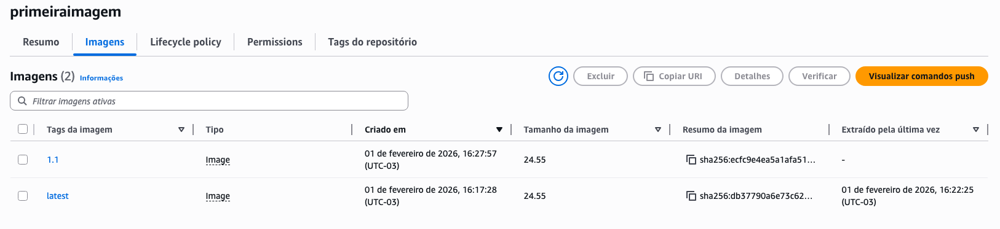

21.  Remova todas as imagens com o padrão primeiraimagem com o comando:
``` shell
docker images --format "{{.Repository}}:{{.Tag}} {{.ID}}" \
| grep "primeiraimagem" \
| awk '{print $2}' \
| xargs -r docker rmi -f
```

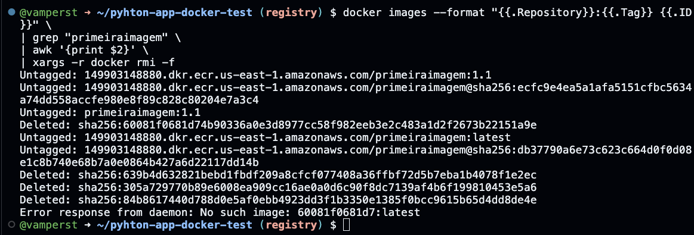

22.   Vamos agora executar um container da nova imagem utilize o comando 
``` shell
docker run -d --name primeira -p 5000:5000 $accountID.dkr.ecr.us-east-1.amazonaws.com/primeiraimagem:1.1
```

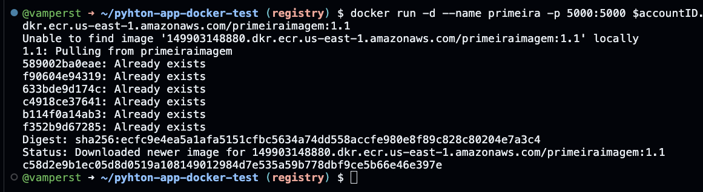
23. Teste no navegador para se certificar que funcionou
    
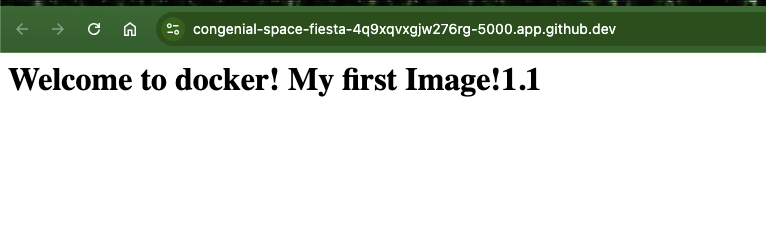

24. Pare e remova o container recem criado conforme os comandos vistos anteriormente na demo. O nome do container é `primeira`
``` shell
docker container stop primeira
docker container rm primeira
``` 